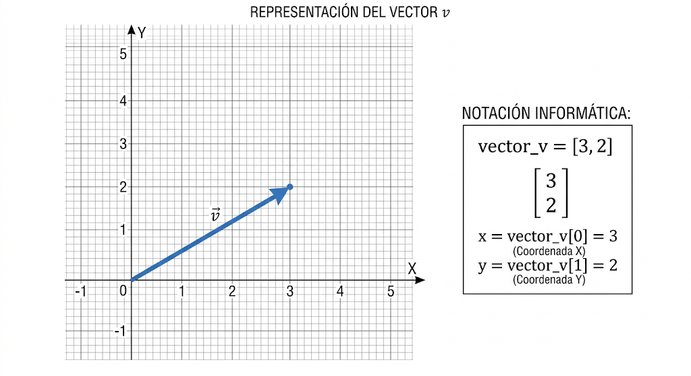
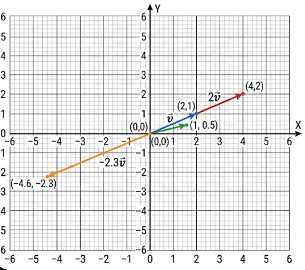

## Vectores y matrices

los vectores se pueden representar de varias formas, una de ellas es la notación
que se usa en fisica: "→", otra es la forma inforamtica "[ab]"

un vector es un punto dentro de un plano pudiendo representar este con ambas notaciones 

## Operaciones de vectores

A modo de resumen las operaciones de los vectores se basan en sumas y multiplicaciones.
### suma

[2, 3] + [5, -2]

cada elemento se debe sumar con el correspondiente de su posición, es decir queda de la siguiente forma: 
[2 + 5, 3 +-1]

### Multiplicación
Tenemos 3 formas de realizar esta operación, esta operacion cada numero multiplicador contra el vector se le llama escalar, puesto que aumenta o disminuye el tamaño de los vectores:
2[ab] → [2a, 2b]
1/2[ab] → El vector se reduce en 1/2
-2.3[ab] → El vector se da vuelta y se escala

